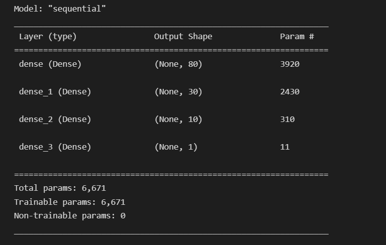
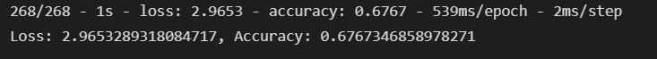

# Neural Network Charity Analysis

---

**File Sources:**

- [charity_data.csv](Resources/charity_data.csv)
- [AlphabetSoupCharity.ipynb](AlphabetSoupCharity.ipynb)
- [AlphabetSoupCharity_Optimization.ipynb](AlphabetSoupCharity_Optimization.ipynb)

**H5 Files:**

- [AlphabetSoupCharity.h5](h5_files/AlphabetSoupCharity.h5)
- [AlphabetSoupCharity_Optimization.h5](h5_files/AlphabetSoupCharity_Optimization.h5)

---

## Purpose:

Use knowledge of machine learning and neural networks to create a binary classifier that is capable of predicting whether applicants will be successful if funded by Alphabet Soup.

From Alphabet Soup’s business team, Beks received a CSV containing more than 34,000 organizations that have received funding from Alphabet Soup over the years. Within this dataset are a number of columns that capture metadata about each organization, such as the following:

- **EIN** and **NAME**—Identification columns
- **APPLICATION_TYPE** —Alphabet Soup application type
- **AFFILIATION** —Affiliated sector of industry
- **CLASSIFICATION** —Government organization classification
- **USE_CASE** —Use case for funding
- **ORGANIZATION** —Organization type
- **STATUS** —Active status
- **INCOME_AMT** —Income classification
- **SPECIAL_CONSIDERATIONS** —Special consideration for application
- **ASK_AMT** —Funding amount requested
- **IS_SUCCESSFUL** —Was the money used effectively

#### Deliverables:

**Deliverable 1:** Preprocessing Data for a Neural Network Model
**Deliverable 2:** Compile, Train, and Evaluate the Model
**Deliverable 3:** Optimize the Model

---

## Results:

**Data Preprocessing:**

- **EIN** and **NAME** are non-beneficial ID columns in the research, so those columns are removed from the input data.
- **IS_SUCCESSFUL** column is the target variable in determing if Alphabet Soup will be funding the project.
- In the AlphabetSoupCharity file, **APPLICATION_TYPE** and **CLASSIFICATION** are checked for binning and a density plot is used to determine the value counts.
- Features for the model were **"APPLICATION_TYPE", "AFFILIATION", "CLASSIFICATION", "USE_CASE", "ORGANIZATION" "ASK_AMT", "INCOME_AMT", "SPECIAL_CONSIDERATIONS"**

**Compiling, Training, and Evaluating the Model:**

This neuron network model comprised of neurons, layers and activation functions. The best result comes from the optimization file where the hidden nodes layers were increased to 80 for the first layer, 30 for the second layer and 10 for the third layer. The activation models used were Relu for the first and second. The output layer activation model used was Sigmoid. These are the typical activation models used for neural networking.

The total parameters was 6,671.

Multiple neuron and activation models were attemped with little to no success. Changing the input features as well as the neuron count and activation models to tanh or simoid did not improve the accuracy. Each attempt yielded an accuracy between 54%-65%.

The best accuracy that was acheived by using this model was ~75% with 100 Epochs which is well below our goal of 90-100%. This model is not accurate and would require further research and analysis.

## 

## Summary:

Using the deep learning neural network model, more analysis or data needs to be gathered to improve the accuracy to determine what projects Alphabet Soup should be funding. Potentially changing the methods of determining accuracy overall would benefit decision making, such as running a Random Forest Classifier or logistcal regression model.
